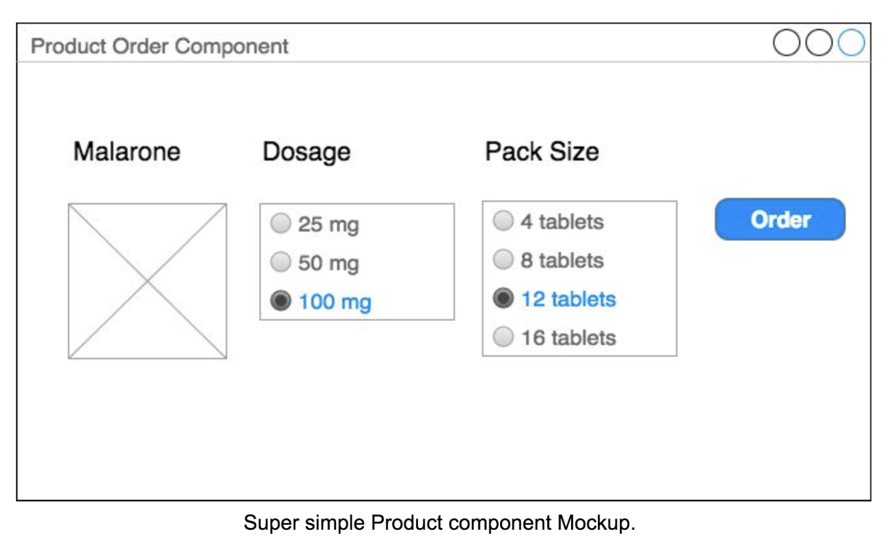
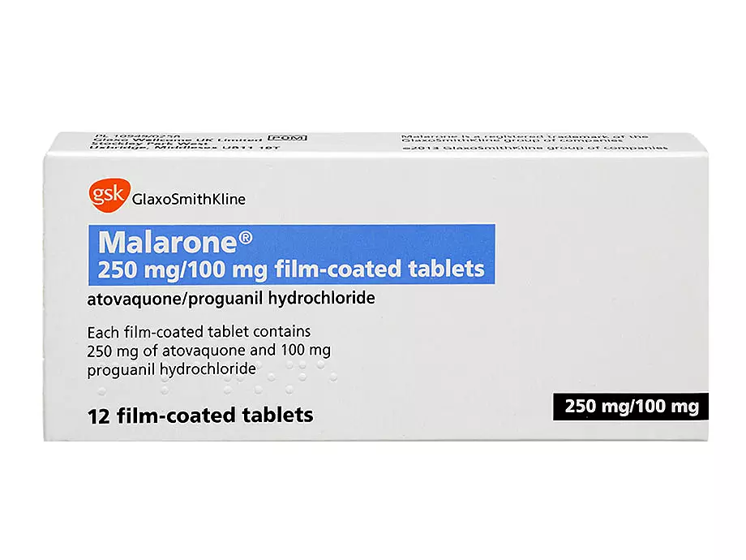

# Pair Programming Exercise

Please create a Product order component using a TDD approach. 

You can use whatever frontend framework you like to do the exercise.

The interface should contain:
- Product Image
- A dosage selection control
- Pack size selection control
- An order button

Once the user selects the desired dosage and pack size then when clicking the order button
please alert or render a summary (name, dosage and pack size selected) of the relevant
order.

Media:

